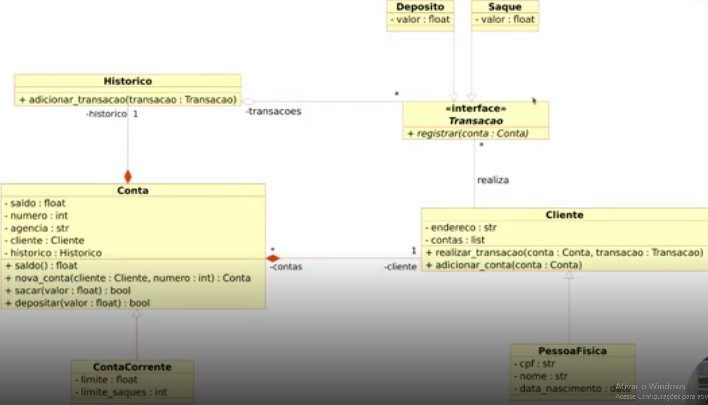

# Sistema bancário com Python

Sistema bancário simples realizado como desafio de projeto no bootcamp Python AI backend da DIO patrocinado pela VIVO.

# V1 - Conhecimentos básicos

## Funções propostas

### Depósito

Para depositar, a única condição é que seu depósito seja de um valor positivo maior que zero (depósito > 0). Cada depósito será registrado no histórico do extrato.

### Saque

Para sacar, existem mais condições, onde um saque também tem que ser positivo maior que zero (saque > 0), mas tem um limite de até 500 reais (saque <= 500). Além disso, o saque não pode exceder o valor do saldo atual da conta (saque <= saldo), e há um limite de até três saques diários (limite_saque = 3). Cada saque será registrado no histórico do extrato.

### Extrato

Somente mostra o extrato da conta após as operações de depósito e saque realizadas, no formato "OPERAÇÃO: R$ 0.00", e ao final mostrando o saldo no mesmo formato sendo OPERAÇÃO = saldo.

# V2 - Uso da Programação Funcional

## Funções propostas

### Modularização do código

Foi proposto nesta versão para usarmos o conceito de modularização, a fim de organizarmos o código, criando funções para cada opção, fazendo com que somente sejam chamadas essas funções.

Para a passagem de argumentos, a função Saque deveria ter todos os parâmetros recebidos por nome, a função Depositar deveria ter todos os parâmetros recebidos por posição, e a função Mostrar_extrato deveria ter parâmetros recebidos por posição e por nome

### Criar usuário

Os usuários criados deverão ser armazenados em uma lista. Cada usuário é composto por um nome, uma data de nascimento, um cpf, e um endereço, formado por logradouro, número, bairro e cidade acompanhada pela sigla do estado. Não pode cadastrar dois usuários com o mesmo CPF.

### Criar conta corrente

As contas criadas deverão ser armazenadas em uma lista. Cada conta é composta por uma agência, um número da conta, e um usuário, o dono da conta, sendo o número da conta um incremental e a agência uma constante "0001". O usuário pode ter mais de uma conta, mas uma conta pertence a um só usuário.

# V3 - Uso da Programação Orientada a Objetos

## Funções propostas

### Criação de classes para o sistema

De início, foram adicionadas as classes de Cliente, da Conta e das operações bancárias de Depósito e Saque, com o objetivo de armazenar os dados de cada um em sua própria instância de objeto, em vez de armazenar em um dicionário. após isso, foram criadas as classes de Histórico, Conta Corrente(herdeira de Conta), Pessoa Física(herdeira de Cliente), e Transação(interface para as classes de Saque e Depósito), seguindo o UML a seguir:

### Dessafio extra

Após a implementação e objetificação do sistema, foi proposto como desafio tratar o Menu como um objeto também, fazendo ele funcionar com as outras classes já modeladas, assim concluindo a migração de paradigma do projeto.